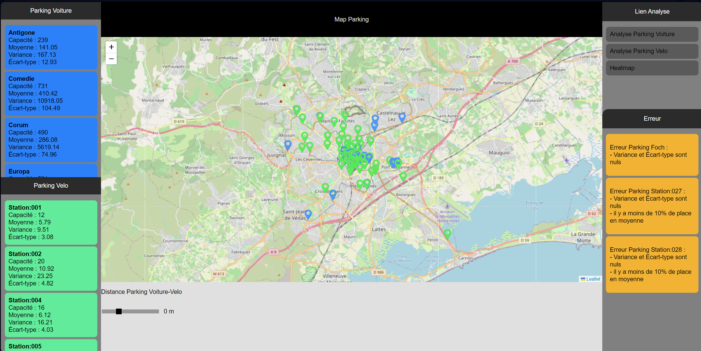
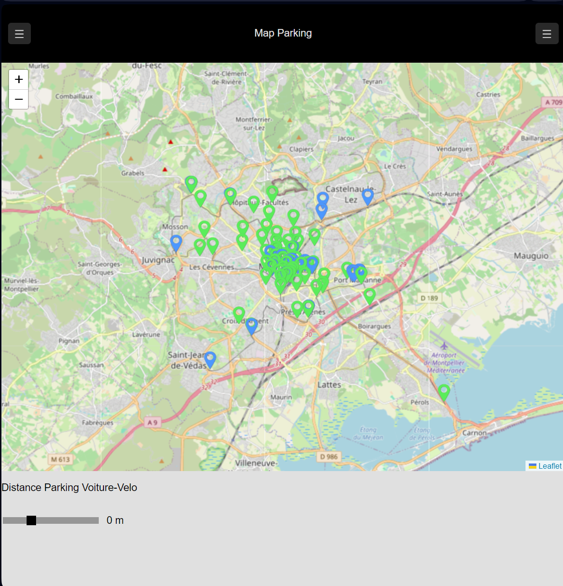
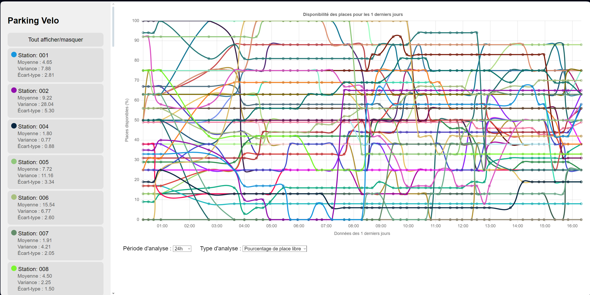
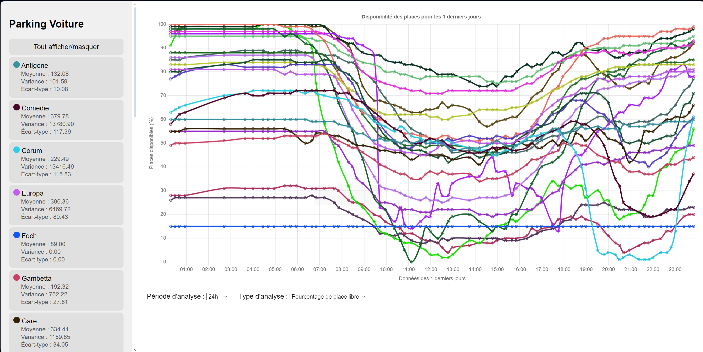
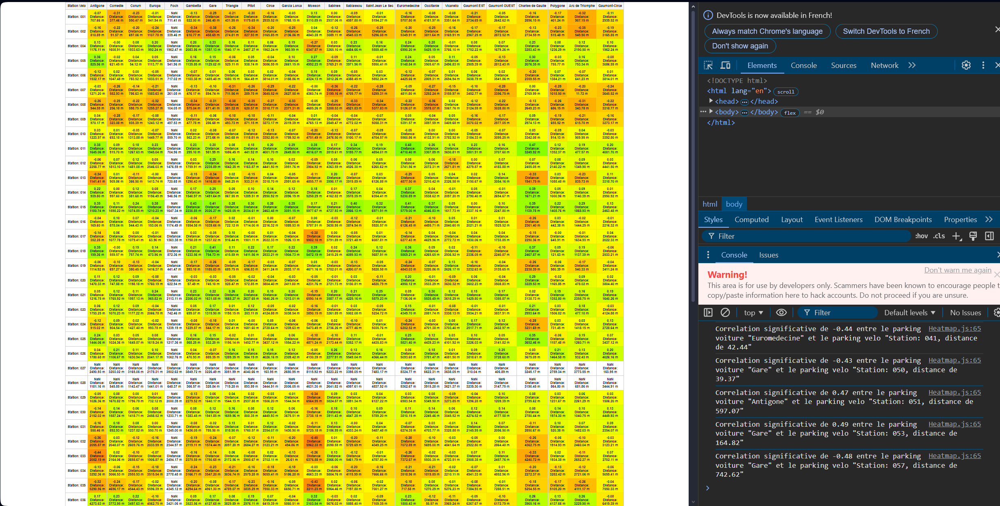

# Analyse  
## SAE1.5 Donnée  
### Tom Wilhem

---

#### Introduction :  
Lors de cette SAE, j'ai appris à automatiser la récupération de données depuis une API, puis à stocker ces données. J'ai également appris à traiter ces données sous forme visuelle afin qu'elles soient facilement et rapidement compréhensibles par un utilisateur lambda. J'ai également appris à en extraire les erreurs de données automatiquement.  

Les fichiers javascripts on l'utilité suivant:
- Calcule.js (Détient toutes les formules vu lors du DM)
- RecupData.js (Permet une recuperation universel des données [Dans les données, j'ai inversé latitude et longitude dû a une erreur lors de mon formatage de fichier json])
- Action.js (sert a l'affiche de la page Acceuil.html qui correspond a la map)
- ActionAnVoiture.js et ActionAnVelo (sert a l'affiche de la page index_voiture.html et index_velo.html qui correspondent au page d'analyse de graphique)
- Heatmap.js (sert a afficher la heatmap de la page Heatmap.html)

#### Index :  
- Page de présentation des parkings, vue globale de la position de chaque point sur une carte avec la distance entre le parking voiture et le parking vélo. Analyse des problèmes de moyenne, variance, écart-type.  
- Page d'analyse de données des parkings, vue globale sur un temps de 24, 168 ou 720 heures, les données sous différents formats. Analyse pour les parkings voiture et vélo. Les graphiques sont analysables individuellement dans la liste.  
- Page d'analyse d'une Heatmap des données de parkings voiture sur les données de parkings vélo, tout en affichant dans la console les éléments avec une corrélation supérieure à 0.4 et inférieure à -0.4.  

---

#### Carte  
Affichage de la carte sur la page web [Map](https://twilhem.github.io/Api-Parking/Web/Acceuil.html).  


On peut voir les différents parkings voiture et vélo sur la gauche de l'écran.  
Les parkings voiture sont dans la liste du haut, et les parkings vélo sont dans la liste du bas.  
On peut voir dans les deux listes de parkings 5 informations :  
- Le nom du parking  
- Sa capacité totale de places  
- Sa moyenne d'occupation  
- Sa variance  
- Son écart-type  

Au centre de l'écran, on peut voir en haut le titre (avec deux boutons si l'on est sur un petit écran), on peut voir tout en bas une zone avec un curseur, et au milieu une carte qui affiche les points chargés dans la zone de gauche sur la carte.  
Lorsque l'on clique sur un parking voiture à gauche, le parking correspondant sur la carte devient rouge et l'écran zoom sur ce dernier. Une fois que vous avez cliqué sur le parking, vous pouvez faire glisser le curseur en dessous de la carte. Ce curseur permet d'afficher les parkings vélo dans une distance que vous définissez. La distance à vol d'oiseau est alors affichée sous le parking vélo et il est classé par ordre croissant.  

Sur la zone de gauche, il y a deux zones. La zone du haut est une zone de liens permettant d'accéder aux autres pages web. La zone en dessous regroupe toutes les erreurs sur les données récupérées.  

Dans la zone de gauche, on peut voir actuellement que le parking "Foch" est en erreur pour une variance et un écart-type de 0, ce qui est impossible, car cela signifierait qu'il n'y a pas de mouvement dans la moyenne et donc aucune entrée ni sortie de personnes. Le nom du parking "Foch" n'est pas en rouge, ce qui signifie qu'il est bien en statut "ouvert". On a également un problème de variance et d'écart-type sur les parkings vélo 27 et 28, mais il est également marqué que leur moyenne de disponibilité de vélos est inférieure à 10 %, il serait donc bon de penser à en construire un autre ou agrandir celui présent.  

Il y a également la possibilité de visualiser ces données sur un plus petit écran, les boutons sur les côtés servent à afficher leur zone respective :  


---

#### Graphique

Analyse des parkings vélo sur la page web [Graphique Vélo](https://twilhem.github.io/Api-Parking/Web/index_velo.html).  
  
Analyse des parkings voiture sur la page web [Graphique Voiture](https://twilhem.github.io/Api-Parking/Web/Index_Voiture.html).  


Nous avons deux pages web qui ont la même utilité, celle d'analyser des données sur une période donnée.  

Ces deux pages suivent le même modèle avec les parkings dans une zone défilante sur la zone de gauche, chaque parking ayant respectivement son nom, sa moyenne, sa variance et son écart-type. Cette liste est surmontée par un bouton qui permet de masquer chaque parking sur le graphique. En effet, si l'on appuie sur un parking, seul celui-ci disparaît et est retiré du graphique. Cette option permet d'analyser un seul parking à la fois.  

En dessous de la liste des parkings, nous avons deux listes déroulantes. La première est une liste de temps (24, 168 et 720 heures) qui définit sur combien de temps l'analyse est effectuée. La deuxième liste permet de passer d'une analyse du "pourcentage de places libres" à une analyse du "nombre de places libres".  

On peut constater sur ce graphique que la plupart des parkings sont plutôt vides la nuit, mais se remplissent beaucoup à partir de 9h pour commencer à se vider vers 17h et se remplir à nouveau vers 19h pour finalement se vider vers 23h-minuit. On peut en conclure que des parkings comme "Corum" et "Sabine" sont parfois complets, ce qui est à surveiller. On peut également faire l'analyse sur un mois en sélectionnant uniquement un seul parking afin de voir si celui-ci a tendance à se remplir de plus en plus ou à perdre de l'occupation. On peut observer un problème au niveau de mon parking "Foch", qui reste en ligne droite, donc sans changement, ce qui n'est pas possible.  

Comme pour la page de la carte, cette page peut être adaptée à un plus petit écran grâce à son bouton :  


---

#### Heatmap

Tableau Heatmap sur cette page web [Heatmap](https://twilhem.github.io/Api-Parking/Web/Heatmap.html).  


Cette page web est une Heatmap (matrice de corrélation colorée) des données de parkings voiture sur des données de parkings vélo. Dans chaque case, nous avons la corrélation des deux listes de données plus la distance qui les sépare. Le code attribue une couleur différente en fonction de la corrélation. Plus la couleur se rapproche du rouge, plus la corrélation tend vers -1. Plus la couleur se rapproche du vert, plus la corrélation tend vers 1. Plus la couleur se rapproche du jaune, plus la corrélation tend vers 0. Sachant que plus le chiffre se rapproche de 1 ou -1, plus la corrélation est grande, donc plus la couleur tend vers le jaune. Moins il y a de correspondance entre les deux listes, plus la couleur s'éloigne de ce spectre.  

On peut voir sur la Heatmap des parkings en blanc avec la valeur de corrélation "NAN". Ces parkings sont en erreur car leur liste est identique de début à fin. Lorsqu'on regarde les parkings en erreur, on constate que c'est toujours le parking "Foch" avec les deux parkings vélo "27" et "28".  

Si l'on ouvre la console, on peut également voir quels parkings ont une corrélation supérieure à 0.4 ou inférieure à -0.4 tout en étant à une distance inférieure à 750 m, que j'ai définie comme la distance maximale de marche pour un utilisateur avant qu'il ne se dise "ça ne vaut plus le coup".  
On peut voir plusieurs parkings sortir tels que ceci :  
```
Correlation significative de -0.44 entre le parking voiture "Euromedecine" et le parking velo "Station: 041, distance de 42.44"
Correlation significative de -0.43 entre le parking voiture "Gare" et le parking velo "Station: 050, distance de 39.37"
Correlation significative de 0.47 entre le parking voiture "Antigone" et le parking velo "Station: 051, distance de 597.07"
Correlation significative de 0.49 entre le parking voiture "Gare" et le parking velo "Station: 053, distance de 164.82"
Correlation significative de -0.48 entre le parking voiture "Gare" et le parking velo "Station: 057, distance de 742.62"
```
